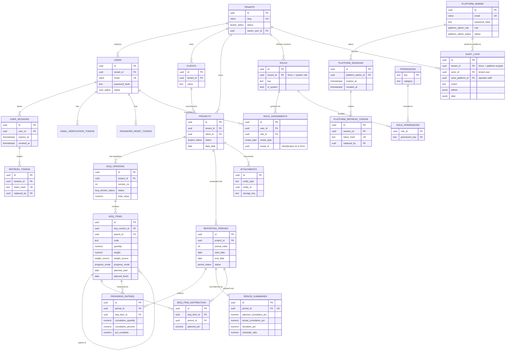

# BACKEND.md — Construction MK Progress Dashboard

Backend foundation for a multi-tenant SaaS that lets construction **management consultant (MK)** firms centralize their projects and visualize **planned vs. actual** progress using BoQ-weighted earned value (the *kurva-S* / S-curve).

This document is the source of truth for the data layer: PostgreSQL schema (DDL), multi-tenancy + row-level security, granular RBAC, the BoQ baseline lifecycle, the progress/period model, the derivation engine that produces all visualizations, and the ERD.

---

## 1. Architecture decisions

| Concern | Decision |
|---|---|
| Database | PostgreSQL 15+ (uses `security_invoker` views, generated columns) |
| Multi-tenancy | Shared database, shared tables, `tenant_id` on every tenant-scoped row, **hard-isolated with Row-Level Security (RLS)** — not app-filtering alone |
| Tenant hierarchy | `tenant` (firm) → `client` (project owner, no login) → `project` → `boq_version` (baseline) → `boq_item` |
| Admin tiers | **Two distinct planes.** *Platform admins* (SaaS operator staff) live **outside** the tenant model, manage firms, and cross tenant boundaries via a controlled RLS bypass. *Tenant admins* are ordinary `users` holding the `admin` role at `scope_type = 'tenant'`. |
| Auth | **System-owned**: email + hashed password, server-managed login sessions, rotating refresh tokens, email-verification & password-reset tokens. Platform admins have a **separate** identity + session store. |
| Authorization | Scoped RBAC for tenant users: permission catalog → roles (system + tenant-custom) → role assignments scoped at `tenant` / `client` / `project`. Platform admins bypass tenant RBAC and carry their own coarse `platform_admin_role`. |
| BoQ | Versioned baselines: `draft` → `active` → `superseded`; variation orders spawn a new version, originals retained |
| Progress | Per-item, **cumulative-to-date**; `by_quantity` for measurable units, `by_percent` for lump-sum; weekly delta is derived |
| Metrics | S-curve / deviation / schedule-ratio computed on read; a `period_summaries` cache speeds up portfolio scans |
| Identifiers | UUID primary keys (`gen_random_uuid()`), `timestamptz` everywhere |
| History | `created_*` / `updated_*` columns, soft-delete where history matters, append-only `audit_logs` |

The **method is fixed** (the same for every firm); only the **input data** varies. That is what makes cross-project, cross-client comparison trustworthy.

---

## 2. Conventions

Every **tenant-scoped** table carries:

```sql
tenant_id   uuid        NOT NULL REFERENCES tenants(id) ON DELETE CASCADE,
created_at  timestamptz NOT NULL DEFAULT now(),
updated_at  timestamptz NOT NULL DEFAULT now(),
created_by  uuid        REFERENCES users(id),
updated_by  uuid        REFERENCES users(id)
```

- `deleted_at timestamptz` is added where rows must survive logically (clients, projects, boq items).
- `updated_at` is maintained by a trigger (§7).
- All money/quantity columns use `numeric` (never float). Weights are stored as a percentage (`0–100`).
- RLS reads tenant context from the session GUC `app.current_tenant_id` (§6).

```sql
CREATE EXTENSION IF NOT EXISTS pgcrypto;  -- gen_random_uuid()
CREATE EXTENSION IF NOT EXISTS citext;    -- case-insensitive email
```

---

## 3. Enum types

```sql
CREATE TYPE tenant_status       AS ENUM ('active','suspended','cancelled');
CREATE TYPE user_status         AS ENUM ('invited','active','suspended','deactivated');
CREATE TYPE platform_admin_role   AS ENUM ('super_admin','support','billing','read_only');
CREATE TYPE platform_admin_status AS ENUM ('invited','active','suspended','deactivated');
CREATE TYPE scope_type          AS ENUM ('tenant','client','project');
CREATE TYPE project_status      AS ENUM ('planning','active','on_hold','completed','cancelled');
CREATE TYPE boq_version_status  AS ENUM ('draft','active','superseded','archived');
CREATE TYPE weight_source       AS ENUM ('derived','manual');
CREATE TYPE distribution_type   AS ENUM ('linear','manual');
CREATE TYPE progress_mode       AS ENUM ('by_quantity','by_percent');
CREATE TYPE period_status       AS ENUM ('open','submitted','approved','locked');
```

---

## 4. Schema (DDL)

### 4.1 Tenancy & identity

```sql
-- The SaaS customers: consulting firms. Root of the tenant tree (not tenant-scoped).
CREATE TABLE tenants (
    id             uuid PRIMARY KEY DEFAULT gen_random_uuid(),
    name           text          NOT NULL,
    slug           citext        NOT NULL UNIQUE,
    status         tenant_status NOT NULL DEFAULT 'active',
    owner_user_id  uuid,                          -- FK added after users exists (set at signup)
    settings       jsonb         NOT NULL DEFAULT '{}'::jsonb,
    created_at     timestamptz   NOT NULL DEFAULT now(),
    updated_at     timestamptz   NOT NULL DEFAULT now()
);

-- One account per email (global). A person at two firms uses two accounts.
-- Alternative (global user + memberships) is noted in §11.
CREATE TABLE users (
    id                  uuid PRIMARY KEY DEFAULT gen_random_uuid(),
    tenant_id           uuid        NOT NULL REFERENCES tenants(id) ON DELETE CASCADE,
    email               citext      NOT NULL UNIQUE,
    password_hash       text,                       -- null until first password set (invited)
    full_name           text        NOT NULL,
    status              user_status NOT NULL DEFAULT 'invited',
    email_verified_at   timestamptz,
    last_login_at       timestamptz,
    failed_login_count  int         NOT NULL DEFAULT 0,
    locked_until        timestamptz,
    created_at          timestamptz NOT NULL DEFAULT now(),
    updated_at          timestamptz NOT NULL DEFAULT now(),
    created_by          uuid REFERENCES users(id),
    updated_by          uuid REFERENCES users(id)
);
CREATE INDEX idx_users_tenant ON users(tenant_id);

ALTER TABLE tenants
    ADD CONSTRAINT fk_tenants_owner FOREIGN KEY (owner_user_id) REFERENCES users(id);

-- A login session (one per device/browser). Refresh tokens rotate within it.
CREATE TABLE user_sessions (
    id            uuid PRIMARY KEY DEFAULT gen_random_uuid(),
    tenant_id     uuid        NOT NULL REFERENCES tenants(id) ON DELETE CASCADE,
    user_id       uuid        NOT NULL REFERENCES users(id) ON DELETE CASCADE,
    user_agent    text,
    ip_address    inet,
    created_at    timestamptz NOT NULL DEFAULT now(),
    last_seen_at  timestamptz NOT NULL DEFAULT now(),
    expires_at    timestamptz NOT NULL,
    revoked_at    timestamptz
);
CREATE INDEX idx_sessions_user ON user_sessions(user_id) WHERE revoked_at IS NULL;

-- Rotating refresh tokens. Store only the hash. `replaced_by` forms the rotation chain;
-- reuse of a rotated/revoked token signals theft -> revoke the whole session.
CREATE TABLE refresh_tokens (
    id           uuid PRIMARY KEY DEFAULT gen_random_uuid(),
    tenant_id    uuid        NOT NULL REFERENCES tenants(id) ON DELETE CASCADE,
    session_id   uuid        NOT NULL REFERENCES user_sessions(id) ON DELETE CASCADE,
    token_hash   text        NOT NULL UNIQUE,
    expires_at   timestamptz NOT NULL,
    used_at      timestamptz,
    revoked_at   timestamptz,
    replaced_by  uuid REFERENCES refresh_tokens(id),
    created_at   timestamptz NOT NULL DEFAULT now()
);
CREATE INDEX idx_refresh_session ON refresh_tokens(session_id);

CREATE TABLE email_verification_tokens (
    id          uuid PRIMARY KEY DEFAULT gen_random_uuid(),
    user_id     uuid        NOT NULL REFERENCES users(id) ON DELETE CASCADE,
    token_hash  text        NOT NULL UNIQUE,
    expires_at  timestamptz NOT NULL,
    used_at     timestamptz,
    created_at  timestamptz NOT NULL DEFAULT now()
);

CREATE TABLE password_reset_tokens (
    id          uuid PRIMARY KEY DEFAULT gen_random_uuid(),
    user_id     uuid        NOT NULL REFERENCES users(id) ON DELETE CASCADE,
    token_hash  text        NOT NULL UNIQUE,
    expires_at  timestamptz NOT NULL,
    used_at     timestamptz,
    created_at  timestamptz NOT NULL DEFAULT now()
);
```

#### Platform-admin plane (SaaS operator staff)

Platform admins are **not** `users` and are **not** tenant-scoped — they are the operator's own staff who provision and oversee firms. They live in their own tables (separate identity, separate sessions) so the tenant-isolation invariant (`users.tenant_id NOT NULL`, globally-unique email) is never bent. Authorization is a coarse `platform_admin_role`, not the tenant RBAC graph. Their cross-tenant reach is granted by a controlled RLS bypass (§6), never by a tenant context.

```sql
-- The operator's own staff. Global, tenant-agnostic. Email namespace is independent
-- of users.email (a person may be both a firm user and an operator admin).
CREATE TABLE platform_admins (
    id                  uuid PRIMARY KEY DEFAULT gen_random_uuid(),
    email               citext               NOT NULL UNIQUE,
    password_hash       text,                                  -- null until first password set (invited)
    full_name           text                 NOT NULL,
    role                platform_admin_role  NOT NULL DEFAULT 'support',
    status              platform_admin_status NOT NULL DEFAULT 'invited',
    email_verified_at   timestamptz,
    last_login_at       timestamptz,
    failed_login_count  int                  NOT NULL DEFAULT 0,
    locked_until        timestamptz,
    created_at          timestamptz          NOT NULL DEFAULT now(),
    updated_at          timestamptz          NOT NULL DEFAULT now(),
    created_by          uuid REFERENCES platform_admins(id),   -- who invited this admin
    deactivated_at      timestamptz
);

-- Platform-admin login sessions + rotating refresh tokens (mirrors the tenant-user
-- machinery, but keyed to platform_admins and never tenant-scoped).
CREATE TABLE platform_sessions (
    id                 uuid PRIMARY KEY DEFAULT gen_random_uuid(),
    platform_admin_id  uuid        NOT NULL REFERENCES platform_admins(id) ON DELETE CASCADE,
    user_agent         text,
    ip_address         inet,
    created_at         timestamptz NOT NULL DEFAULT now(),
    last_seen_at       timestamptz NOT NULL DEFAULT now(),
    expires_at         timestamptz NOT NULL,
    revoked_at         timestamptz
);
CREATE INDEX idx_platform_sessions_admin ON platform_sessions(platform_admin_id) WHERE revoked_at IS NULL;

CREATE TABLE platform_refresh_tokens (
    id           uuid PRIMARY KEY DEFAULT gen_random_uuid(),
    session_id   uuid        NOT NULL REFERENCES platform_sessions(id) ON DELETE CASCADE,
    token_hash   text        NOT NULL UNIQUE,
    expires_at   timestamptz NOT NULL,
    used_at      timestamptz,
    revoked_at   timestamptz,
    replaced_by  uuid REFERENCES platform_refresh_tokens(id),
    created_at   timestamptz NOT NULL DEFAULT now()
);
CREATE INDEX idx_platform_refresh_session ON platform_refresh_tokens(session_id);
```

> **`platform_admins`, `platform_sessions`, `platform_refresh_tokens` are NOT tenant-scoped** and therefore carry **no** `tenant_id` and get **no** `tenant_isolation` RLS policy. They are reachable only through the auth/operator path (§6), the same way `permissions` is a global table.

> **Login under RLS.** Authentication looks up a user *by email before tenant context exists*. Resolve this by running the login lookup through a `SECURITY DEFINER` function (or a dedicated `BYPASSRLS` application role). Once the user row is found, the app sets `app.current_tenant_id = users.tenant_id` for the rest of the request. See §6.

### 4.2 Authorization (granular RBAC)

```sql
-- Global permission catalog (system-seeded, readable by all tenants).
CREATE TABLE permissions (
    key          text PRIMARY KEY,          -- e.g. 'project.view', 'boq.edit'
    category     text NOT NULL,             -- grouping for UI
    description  text NOT NULL
);

-- System roles (tenant_id NULL, shared) + tenant-custom roles.
CREATE TABLE roles (
    id          uuid PRIMARY KEY DEFAULT gen_random_uuid(),
    tenant_id   uuid REFERENCES tenants(id) ON DELETE CASCADE,   -- NULL = system role
    key         text NOT NULL,             -- 'admin','project_manager','field_engineer','viewer'
    name        text NOT NULL,
    description text,
    is_system   boolean NOT NULL DEFAULT false,
    created_at  timestamptz NOT NULL DEFAULT now(),
    updated_at  timestamptz NOT NULL DEFAULT now(),
    UNIQUE (tenant_id, key)                 -- (NULL,key) unique handled by partial index below
);
CREATE UNIQUE INDEX uq_roles_system_key ON roles(key) WHERE tenant_id IS NULL;

CREATE TABLE role_permissions (
    role_id         uuid NOT NULL REFERENCES roles(id) ON DELETE CASCADE,
    permission_key  text NOT NULL REFERENCES permissions(key) ON DELETE CASCADE,
    PRIMARY KEY (role_id, permission_key)
);

-- The granular grant: a user holds a role at a scope.
-- scope_id is NULL for tenant-wide; the client/project id otherwise.
CREATE TABLE role_assignments (
    id          uuid PRIMARY KEY DEFAULT gen_random_uuid(),
    tenant_id   uuid        NOT NULL REFERENCES tenants(id) ON DELETE CASCADE,
    user_id     uuid        NOT NULL REFERENCES users(id) ON DELETE CASCADE,
    role_id     uuid        NOT NULL REFERENCES roles(id) ON DELETE CASCADE,
    scope_type  scope_type  NOT NULL,
    scope_id    uuid,                       -- NULL when scope_type = 'tenant'
    created_at  timestamptz NOT NULL DEFAULT now(),
    created_by  uuid REFERENCES users(id),
    CONSTRAINT chk_scope_id CHECK (
        (scope_type = 'tenant' AND scope_id IS NULL) OR
        (scope_type <> 'tenant' AND scope_id IS NOT NULL)
    ),
    UNIQUE (user_id, role_id, scope_type, scope_id)
);
CREATE INDEX idx_assign_user ON role_assignments(user_id);
CREATE INDEX idx_assign_scope ON role_assignments(scope_type, scope_id);
```

**Permission resolution.** A user's effective permissions on a project are the union of permissions from every role assigned at a scope that *covers* that project — tenant-wide, on its client, or on the project itself:

```sql
CREATE OR REPLACE FUNCTION fn_user_project_permissions(p_user uuid, p_project uuid)
RETURNS TABLE (permission_key text)
LANGUAGE sql STABLE AS $$
    SELECT DISTINCT rp.permission_key
    FROM role_assignments ra
    JOIN role_permissions rp ON rp.role_id = ra.role_id
    JOIN projects pr ON pr.id = p_project AND pr.tenant_id = ra.tenant_id
    WHERE ra.user_id = p_user
      AND (
            ra.scope_type = 'tenant'
        OR (ra.scope_type = 'client'  AND ra.scope_id = pr.client_id)
        OR (ra.scope_type = 'project' AND ra.scope_id = pr.id)
      );
$$;
```

### 4.3 Clients & projects

```sql
CREATE TABLE clients (
    id          uuid PRIMARY KEY DEFAULT gen_random_uuid(),
    tenant_id   uuid        NOT NULL REFERENCES tenants(id) ON DELETE CASCADE,
    name        text        NOT NULL,
    code        text,
    contact     jsonb       NOT NULL DEFAULT '{}'::jsonb,   -- pic, email, phone, address
    created_at  timestamptz NOT NULL DEFAULT now(),
    updated_at  timestamptz NOT NULL DEFAULT now(),
    created_by  uuid REFERENCES users(id),
    updated_by  uuid REFERENCES users(id),
    deleted_at  timestamptz,
    UNIQUE (tenant_id, code)
);
CREATE INDEX idx_clients_tenant ON clients(tenant_id) WHERE deleted_at IS NULL;

CREATE TABLE projects (
    id              uuid PRIMARY KEY DEFAULT gen_random_uuid(),
    tenant_id       uuid           NOT NULL REFERENCES tenants(id) ON DELETE CASCADE,
    client_id       uuid           NOT NULL REFERENCES clients(id),
    name            text           NOT NULL,
    code            text,
    description     text,
    location        text,
    contract_no     text,
    contract_value  numeric(20,2),
    contract_start  date,
    contract_finish date,
    status          project_status NOT NULL DEFAULT 'planning',
    -- reporting cadence
    period_type     text           NOT NULL DEFAULT 'weekly',  -- 'weekly' | 'biweekly' | 'monthly'
    week_start_dow  int            NOT NULL DEFAULT 1,          -- 1 = Monday
    schedule_start  date,                                       -- anchor for period generation
    data_date       date,                                       -- as-of cutoff for actuals (latest approved period end)
    created_at      timestamptz    NOT NULL DEFAULT now(),
    updated_at      timestamptz    NOT NULL DEFAULT now(),
    created_by      uuid REFERENCES users(id),
    updated_by      uuid REFERENCES users(id),
    deleted_at      timestamptz,
    UNIQUE (tenant_id, code)
);
CREATE INDEX idx_projects_tenant ON projects(tenant_id) WHERE deleted_at IS NULL;
CREATE INDEX idx_projects_client ON projects(client_id);
```

### 4.4 BoQ — versioned baseline

```sql
CREATE TABLE boq_versions (
    id            uuid PRIMARY KEY DEFAULT gen_random_uuid(),
    tenant_id     uuid               NOT NULL REFERENCES tenants(id) ON DELETE CASCADE,
    project_id    uuid               NOT NULL REFERENCES projects(id) ON DELETE CASCADE,
    version_no    int                NOT NULL,
    title         text               NOT NULL,           -- 'Original Contract', 'VO-01', ...
    status        boq_version_status NOT NULL DEFAULT 'draft',
    reason        text,                                   -- why this revision exists
    total_value   numeric(20,2),                          -- cached sum of leaf values
    baselined_at  timestamptz,
    baselined_by  uuid REFERENCES users(id),
    created_at    timestamptz NOT NULL DEFAULT now(),
    updated_at    timestamptz NOT NULL DEFAULT now(),
    created_by    uuid REFERENCES users(id),
    updated_by    uuid REFERENCES users(id),
    UNIQUE (project_id, version_no)
);
-- At most one active baseline per project.
CREATE UNIQUE INDEX uq_boq_active ON boq_versions(project_id) WHERE status = 'active';

CREATE TABLE boq_items (
    id              uuid PRIMARY KEY DEFAULT gen_random_uuid(),
    tenant_id       uuid          NOT NULL REFERENCES tenants(id) ON DELETE CASCADE,
    project_id      uuid          NOT NULL REFERENCES projects(id) ON DELETE CASCADE,
    boq_version_id  uuid          NOT NULL REFERENCES boq_versions(id) ON DELETE CASCADE,
    parent_id       uuid          REFERENCES boq_items(id) ON DELETE CASCADE,
    code            text          NOT NULL,               -- WBS: '1', '2.1', '2.1.1'
    description     text          NOT NULL,
    unit            text,                                  -- m3, m2, m1, kg, ls, titik, unit
    quantity        numeric(20,4),
    unit_rate       numeric(20,4),
    value           numeric(20,2) GENERATED ALWAYS AS (quantity * unit_rate) STORED,
    weight          numeric(9,6)  NOT NULL DEFAULT 0,      -- bobot %, leaves only meaningful
    weight_source   weight_source NOT NULL DEFAULT 'derived',
    planned_start   date,
    planned_finish  date,
    distribution    distribution_type NOT NULL DEFAULT 'linear',
    progress_mode   progress_mode NOT NULL DEFAULT 'by_quantity',
    sort_order      int           NOT NULL DEFAULT 0,
    created_at      timestamptz   NOT NULL DEFAULT now(),
    updated_at      timestamptz   NOT NULL DEFAULT now(),
    deleted_at      timestamptz,
    UNIQUE (boq_version_id, code),
    CONSTRAINT chk_dates CHECK (planned_finish IS NULL OR planned_start IS NULL OR planned_finish >= planned_start)
);
CREATE INDEX idx_boq_items_version ON boq_items(boq_version_id);
CREATE INDEX idx_boq_items_parent  ON boq_items(parent_id);

-- Optional per-period planned weight override (only when distribution = 'manual').
-- When absent, the planned curve is computed linearly from planned_start/finish (§8).
CREATE TABLE boq_item_distribution (
    id               uuid PRIMARY KEY DEFAULT gen_random_uuid(),
    tenant_id        uuid        NOT NULL REFERENCES tenants(id) ON DELETE CASCADE,
    boq_item_id      uuid        NOT NULL REFERENCES boq_items(id) ON DELETE CASCADE,
    period_id        uuid        NOT NULL REFERENCES reporting_periods(id) ON DELETE CASCADE,
    planned_pct      numeric(9,6) NOT NULL,   -- fraction of THIS item completed in this period (0-100)
    UNIQUE (boq_item_id, period_id)
);
```

> Leaves carry the weight; parents are pure rollups. The "sum of leaf weights = 100%" invariant is validated when a version is activated (§7), not as a per-row `CHECK` (which cannot sum across rows).

### 4.5 Reporting periods & progress

```sql
CREATE TABLE reporting_periods (
    id            uuid PRIMARY KEY DEFAULT gen_random_uuid(),
    tenant_id     uuid          NOT NULL REFERENCES tenants(id) ON DELETE CASCADE,
    project_id    uuid          NOT NULL REFERENCES projects(id) ON DELETE CASCADE,
    period_index  int           NOT NULL,         -- 1,2,3...
    label         text,                            -- 'Week 5', 'Bulan 2 - M1'
    start_date    date          NOT NULL,
    end_date      date          NOT NULL,
    status        period_status NOT NULL DEFAULT 'open',
    submitted_at  timestamptz,  submitted_by  uuid REFERENCES users(id),
    approved_at   timestamptz,  approved_by   uuid REFERENCES users(id),
    created_at    timestamptz   NOT NULL DEFAULT now(),
    updated_at    timestamptz   NOT NULL DEFAULT now(),
    UNIQUE (project_id, period_index),
    CONSTRAINT chk_period_dates CHECK (end_date >= start_date)
);
CREATE INDEX idx_periods_project ON reporting_periods(project_id, end_date);

-- Per-item actuals, CUMULATIVE-TO-DATE. Weekly delta is derived, never stored.
-- Input column used depends on the item's progress_mode; pct_complete is computed (§7).
CREATE TABLE progress_entries (
    id                   uuid PRIMARY KEY DEFAULT gen_random_uuid(),
    tenant_id            uuid          NOT NULL REFERENCES tenants(id) ON DELETE CASCADE,
    project_id           uuid          NOT NULL REFERENCES projects(id) ON DELETE CASCADE,
    period_id            uuid          NOT NULL REFERENCES reporting_periods(id) ON DELETE CASCADE,
    boq_item_id          uuid          NOT NULL REFERENCES boq_items(id) ON DELETE CASCADE,
    cumulative_quantity  numeric(20,4),               -- used when progress_mode = 'by_quantity'
    cumulative_percent   numeric(9,4),                -- used when progress_mode = 'by_percent'
    pct_complete         numeric(9,4)  NOT NULL DEFAULT 0,  -- computed 0-100
    note                 text,
    recorded_at          timestamptz   NOT NULL DEFAULT now(),
    recorded_by          uuid REFERENCES users(id),
    created_at           timestamptz   NOT NULL DEFAULT now(),
    updated_at           timestamptz   NOT NULL DEFAULT now(),
    UNIQUE (period_id, boq_item_id)
);
CREATE INDEX idx_progress_item ON progress_entries(boq_item_id);
CREATE INDEX idx_progress_period ON progress_entries(period_id);

-- Denormalized cache for fast portfolio queries; refreshed on period approval (§8).
CREATE TABLE period_summaries (
    id                       uuid PRIMARY KEY DEFAULT gen_random_uuid(),
    tenant_id                uuid        NOT NULL REFERENCES tenants(id) ON DELETE CASCADE,
    project_id               uuid        NOT NULL REFERENCES projects(id) ON DELETE CASCADE,
    period_id                uuid        NOT NULL REFERENCES reporting_periods(id) ON DELETE CASCADE,
    planned_cumulative_pct   numeric(9,4),
    actual_cumulative_pct    numeric(9,4),
    planned_weekly_pct       numeric(9,4),
    actual_weekly_pct        numeric(9,4),
    deviation_pct            numeric(9,4),    -- actual_cum - planned_cum (+ = ahead)
    schedule_ratio           numeric(9,4),    -- actual_cum / planned_cum (SPI-like)
    computed_at              timestamptz NOT NULL DEFAULT now(),
    UNIQUE (period_id)
);
CREATE INDEX idx_summaries_project ON period_summaries(project_id);
```

### 4.6 Audit & attachments

```sql
-- tenant_id is NULL for platform-level actions (e.g. 'tenant.suspend', 'tenant.create')
-- that happen above any single firm. Exactly one actor is set: a tenant user OR a
-- platform admin.
CREATE TABLE audit_logs (
    id                 uuid PRIMARY KEY DEFAULT gen_random_uuid(),
    tenant_id          uuid        REFERENCES tenants(id) ON DELETE CASCADE,   -- NULL = platform-scoped
    actor_id           uuid        REFERENCES users(id),                       -- tenant-user actor
    actor_platform_id  uuid        REFERENCES platform_admins(id),             -- operator-staff actor
    action             text        NOT NULL,   -- 'boq.baseline.activate', 'tenant.suspend', ...
    entity_type        text        NOT NULL,
    entity_id          uuid,
    before             jsonb,
    after              jsonb,
    ip_address         inet,
    created_at         timestamptz NOT NULL DEFAULT now(),
    CONSTRAINT chk_audit_actor CHECK (NOT (actor_id IS NOT NULL AND actor_platform_id IS NOT NULL))
);
CREATE INDEX idx_audit_tenant_time ON audit_logs(tenant_id, created_at DESC);
CREATE INDEX idx_audit_entity ON audit_logs(entity_type, entity_id);
CREATE INDEX idx_audit_platform_actor ON audit_logs(actor_platform_id, created_at DESC)
    WHERE actor_platform_id IS NOT NULL;

CREATE TABLE attachments (
    id           uuid PRIMARY KEY DEFAULT gen_random_uuid(),
    tenant_id    uuid        NOT NULL REFERENCES tenants(id) ON DELETE CASCADE,
    project_id   uuid        REFERENCES projects(id) ON DELETE CASCADE,
    entity_type  text        NOT NULL,         -- 'progress_entry', 'period', 'project'
    entity_id    uuid        NOT NULL,
    file_name    text        NOT NULL,
    storage_key  text        NOT NULL,         -- object-store key (S3/GCS)
    mime_type    text,
    size_bytes   bigint,
    uploaded_by  uuid REFERENCES users(id),
    created_at   timestamptz NOT NULL DEFAULT now()
);
CREATE INDEX idx_attach_entity ON attachments(entity_type, entity_id);
```

### 4.7 Entity-relationship diagram



---

## 5. Permission catalog (seed)

```sql
INSERT INTO permissions (key, category, description) VALUES
 ('client.view',      'Clients',  'View clients'),
 ('client.manage',    'Clients',  'Create/edit/delete clients'),
 ('project.view',     'Projects', 'View a project and its dashboards'),
 ('project.manage',   'Projects', 'Create/edit/archive projects'),
 ('boq.view',         'BoQ',      'View BoQ versions and items'),
 ('boq.edit',         'BoQ',      'Edit a draft BoQ'),
 ('boq.baseline',     'BoQ',      'Activate a baseline / issue a revision'),
 ('progress.view',    'Progress', 'View progress entries'),
 ('progress.submit',  'Progress', 'Enter/submit weekly progress'),
 ('progress.approve', 'Progress', 'Approve and lock a reporting period'),
 ('member.manage',    'Admin',    'Invite users and assign roles'),
 ('role.manage',      'Admin',    'Create/edit custom roles'),
 ('tenant.manage',    'Admin',    'Manage firm-wide settings');

-- Example system roles (tenant_id NULL).
INSERT INTO roles (id, tenant_id, key, name, is_system) VALUES
 (gen_random_uuid(), NULL, 'admin',          'Administrator',  true),
 (gen_random_uuid(), NULL, 'project_manager','Project Manager',true),
 (gen_random_uuid(), NULL, 'field_engineer', 'Field Engineer', true),
 (gen_random_uuid(), NULL, 'viewer',         'Viewer',         true);
-- role_permissions seeded accordingly: admin = all, PM = project/boq/progress + approve,
-- field_engineer = progress.submit + *.view, viewer = *.view.
```

The `admin` role with `tenant.manage` is the **tenant admin** — full control of one firm. Note these permissions stop at the firm boundary: there is no `tenant.create` / `tenant.suspend` here, because provisioning and overseeing firms is the **platform admin**'s job, and platform admins do not draw from this catalog at all.

**Platform-admin capabilities** are a fixed ladder on `platform_admins.role`, not catalog rows:

| `platform_admin_role` | Can |
|---|---|
| `super_admin` | Everything: create/suspend/cancel tenants, manage other platform admins, read any tenant's data |
| `support`     | Read any tenant's data + create tenants; cannot manage platform admins or billing |
| `billing`     | Tenant lifecycle (suspend/cancel for non-payment) + read-only data |
| `read_only`   | Cross-tenant read for monitoring; no mutations |

Enforcement of this ladder lives in the application/operator API; the database grants the cross-tenant *reach* via the RLS bypass below.

---

## 6. Row-Level Security

There are **two trust planes**, distinguished by which session GUCs are set:

- **Tenant request** — a logged-in firm user. The app sets `app.current_tenant_id`; RLS confines every read/write to that one firm.
- **Platform request** — a logged-in operator admin. The app sets `app.is_platform_admin = 'on'` (and `app.current_platform_admin_id` for audit) and leaves `app.current_tenant_id` unset; RLS opens cross-tenant access for reads, while writes to firm data still flow through the normal tenant path.

Tenant context is set once per request/transaction:

```sql
-- Application connects as a NOSUPERUSER, non-BYPASSRLS role, then ONE of:

-- (a) tenant request
SET LOCAL app.current_tenant_id = '00000000-0000-0000-0000-000000000000';
SET LOCAL app.current_user_id   = '...';   -- optional, for audit defaults

-- (b) platform-admin request (no tenant context)
SET LOCAL app.is_platform_admin        = 'on';
SET LOCAL app.current_platform_admin_id = '...';   -- for audit defaults
```

A small helper centralizes the bypass test so every policy reads the same way:

```sql
CREATE OR REPLACE FUNCTION fn_is_platform_admin() RETURNS boolean
LANGUAGE sql STABLE AS $$
    SELECT current_setting('app.is_platform_admin', true) = 'on'
$$;
```

Standard policy applied to **every tenant-scoped table** (`clients`, `projects`, `boq_versions`, `boq_items`, `boq_item_distribution`, `reporting_periods`, `progress_entries`, `period_summaries`, `audit_logs`, `attachments`, `role_assignments`, `user_sessions`, `refresh_tokens`, `email_verification_tokens`, `password_reset_tokens`, `users`). It admits the matching tenant **or** an authenticated platform admin:

```sql
ALTER TABLE clients ENABLE ROW LEVEL SECURITY;
ALTER TABLE clients FORCE ROW LEVEL SECURITY;

CREATE POLICY tenant_isolation ON clients
    USING      (fn_is_platform_admin()
                OR tenant_id = current_setting('app.current_tenant_id', true)::uuid)
    WITH CHECK (fn_is_platform_admin()
                OR tenant_id = current_setting('app.current_tenant_id', true)::uuid);
-- repeat for each tenant-scoped table
```

> **Read-wide, write-narrow (recommended).** The policy above lets a platform admin write across tenants too. If you want operators to *observe* but not silently mutate firm data, split the policy: keep the `OR fn_is_platform_admin()` only in `USING` (reads) and drop it from `WITH CHECK` (writes), so cross-tenant mutation still requires acting within a real tenant context. Tune per `platform_admin_role` policy in the operator API.

The **`tenants`** table is the operator's primary working set. It is not tenant-scoped (it's the root), so give it its own policy rather than the standard one:

```sql
ALTER TABLE tenants ENABLE ROW LEVEL SECURITY;
ALTER TABLE tenants FORCE ROW LEVEL SECURITY;

CREATE POLICY tenants_access ON tenants
    USING      (fn_is_platform_admin()
                OR id = current_setting('app.current_tenant_id', true)::uuid)
    WITH CHECK (fn_is_platform_admin());   -- only platform admins create/suspend/cancel firms
```

Special cases:

- **`roles`** allows system rows too (and platform admins see all):
  ```sql
  CREATE POLICY roles_visible ON roles
      USING (fn_is_platform_admin()
             OR tenant_id IS NULL
             OR tenant_id = current_setting('app.current_tenant_id', true)::uuid);
  ```
- **`permissions`** is a global catalog: RLS disabled (or a read-all policy).
- **`platform_admins` / `platform_sessions` / `platform_refresh_tokens`** are operator-only: not tenant-scoped, so they get **no** `tenant_isolation` policy. Restrict them to the auth/operator path — either keep RLS off and reach them only through `SECURITY DEFINER` functions / a `BYPASSRLS` operator role, or add a policy gated on `fn_is_platform_admin()` (the bootstrap admin must then be seeded out-of-band).
- **Auth path** (tenant login by email, platform-admin login by email, refresh-token lookup) runs as a `BYPASSRLS` role or through `SECURITY DEFINER` functions, because no context exists yet.
- `current_setting(..., true)` returns `NULL` when unset, so a connection with *neither* tenant context nor the platform flag sees nothing.

---

## 7. Triggers

```sql
-- 7.1 Generic updated_at
CREATE OR REPLACE FUNCTION fn_touch_updated_at() RETURNS trigger
LANGUAGE plpgsql AS $$
BEGIN NEW.updated_at := now(); RETURN NEW; END; $$;
-- attach to: tenants, users, clients, projects, boq_versions, boq_items,
--            reporting_periods, progress_entries, roles  (BEFORE UPDATE)

-- 7.2 Compute pct_complete from the input column based on the item's mode
CREATE OR REPLACE FUNCTION fn_compute_progress_pct() RETURNS trigger
LANGUAGE plpgsql AS $$
DECLARE v_mode progress_mode; v_qty numeric;
BEGIN
    SELECT progress_mode, quantity INTO v_mode, v_qty
    FROM boq_items WHERE id = NEW.boq_item_id;

    IF v_mode = 'by_quantity' THEN
        NEW.pct_complete := LEAST(100, GREATEST(0,
            COALESCE(NEW.cumulative_quantity,0) / NULLIF(v_qty,0) * 100));
    ELSE
        NEW.pct_complete := LEAST(100, GREATEST(0, COALESCE(NEW.cumulative_percent,0)));
    END IF;
    RETURN NEW;
END; $$;
CREATE TRIGGER trg_progress_pct BEFORE INSERT OR UPDATE ON progress_entries
    FOR EACH ROW EXECUTE FUNCTION fn_compute_progress_pct();

-- 7.3 Validate leaf weights ~ 100% when a version is activated
CREATE OR REPLACE FUNCTION fn_validate_baseline_weights() RETURNS trigger
LANGUAGE plpgsql AS $$
DECLARE v_sum numeric;
BEGIN
    IF NEW.status = 'active' AND NEW.status IS DISTINCT FROM OLD.status THEN
        SELECT COALESCE(SUM(weight),0) INTO v_sum
        FROM boq_items i
        WHERE i.boq_version_id = NEW.id
          AND i.deleted_at IS NULL
          AND NOT EXISTS (SELECT 1 FROM boq_items c
                          WHERE c.parent_id = i.id AND c.deleted_at IS NULL);
        IF abs(v_sum - 100) > 0.5 THEN
            RAISE EXCEPTION 'Leaf weights must sum to ~100%% (got %).', v_sum;
        END IF;
    END IF;
    RETURN NEW;
END; $$;
CREATE TRIGGER trg_validate_baseline BEFORE UPDATE ON boq_versions
    FOR EACH ROW EXECUTE FUNCTION fn_validate_baseline_weights();
```

---

## 8. Derivation engine

All visualizations are **computed**, never authored. The raw truth is: leaf `weight` + per-item `pct_complete` per period + planned dates.

**Identity that keeps headline and drill-down reconciled:**

```
project_cumulative_pct = Σ_leaf ( weight × pct_complete / 100 )
item_contribution      = weight × (actual_pct − planned_pct)
project_deviation      = Σ_leaf item_contribution
```

### 8.1 Derive weights from value (when `weight_source = 'derived'`)

```sql
CREATE OR REPLACE FUNCTION fn_recalc_boq_weights(p_version uuid)
RETURNS void LANGUAGE plpgsql AS $$
DECLARE v_total numeric;
BEGIN
    SELECT COALESCE(SUM(value),0) INTO v_total
    FROM boq_items i
    WHERE i.boq_version_id = p_version AND i.weight_source = 'derived'
      AND i.deleted_at IS NULL
      AND NOT EXISTS (SELECT 1 FROM boq_items c WHERE c.parent_id = i.id);

    UPDATE boq_items i
    SET weight = CASE WHEN v_total > 0 THEN value / v_total * 100 ELSE 0 END
    WHERE i.boq_version_id = p_version AND i.weight_source = 'derived'
      AND NOT EXISTS (SELECT 1 FROM boq_items c WHERE c.parent_id = i.id);

    UPDATE boq_versions SET total_value = v_total WHERE id = p_version;
END; $$;
```

### 8.2 Refresh a period's summary (call on period approval)

```sql
CREATE OR REPLACE FUNCTION fn_refresh_period_summary(p_period uuid)
RETURNS void LANGUAGE plpgsql AS $$
DECLARE
    v_project uuid; v_tenant uuid; v_end date; v_version uuid;
    v_planned numeric; v_actual numeric;
    v_prev_planned numeric := 0; v_prev_actual numeric := 0;
BEGIN
    SELECT project_id, tenant_id, end_date INTO v_project, v_tenant, v_end
    FROM reporting_periods WHERE id = p_period;

    SELECT id INTO v_version FROM boq_versions
    WHERE project_id = v_project AND status = 'active';

    -- Planned cumulative: linear spread of each leaf weight across its planned window.
    -- (When boq_item_distribution rows exist for a manual item, sum those instead.)
    SELECT COALESCE(SUM(
        i.weight * LEAST(1, GREATEST(0,
            (v_end - i.planned_start)::numeric
            / NULLIF((i.planned_finish - i.planned_start),0)::numeric))
    ),0) INTO v_planned
    FROM boq_items i
    WHERE i.boq_version_id = v_version AND i.deleted_at IS NULL
      AND i.planned_start IS NOT NULL AND i.planned_finish IS NOT NULL
      AND NOT EXISTS (SELECT 1 FROM boq_items c WHERE c.parent_id = i.id);

    -- Actual cumulative: latest pct_complete per leaf up to this period end.
    SELECT COALESCE(SUM(i.weight * pe.pct_complete / 100.0),0) INTO v_actual
    FROM boq_items i
    JOIN LATERAL (
        SELECT p.pct_complete
        FROM progress_entries p
        JOIN reporting_periods rp ON rp.id = p.period_id
        WHERE p.boq_item_id = i.id AND rp.end_date <= v_end
        ORDER BY rp.end_date DESC LIMIT 1
    ) pe ON true
    WHERE i.boq_version_id = v_version AND i.deleted_at IS NULL
      AND NOT EXISTS (SELECT 1 FROM boq_items c WHERE c.parent_id = i.id);

    SELECT planned_cumulative_pct, actual_cumulative_pct
    INTO v_prev_planned, v_prev_actual
    FROM period_summaries s JOIN reporting_periods rp ON rp.id = s.period_id
    WHERE rp.project_id = v_project AND rp.end_date < v_end
    ORDER BY rp.end_date DESC LIMIT 1;

    INSERT INTO period_summaries (
        id, tenant_id, project_id, period_id,
        planned_cumulative_pct, actual_cumulative_pct,
        planned_weekly_pct, actual_weekly_pct,
        deviation_pct, schedule_ratio, computed_at)
    VALUES (
        gen_random_uuid(), v_tenant, v_project, p_period,
        v_planned, v_actual,
        v_planned - COALESCE(v_prev_planned,0),
        v_actual  - COALESCE(v_prev_actual,0),
        v_actual - v_planned,
        CASE WHEN v_planned > 0 THEN v_actual / v_planned ELSE NULL END,
        now())
    ON CONFLICT (period_id) DO UPDATE SET
        planned_cumulative_pct = EXCLUDED.planned_cumulative_pct,
        actual_cumulative_pct  = EXCLUDED.actual_cumulative_pct,
        planned_weekly_pct     = EXCLUDED.planned_weekly_pct,
        actual_weekly_pct      = EXCLUDED.actual_weekly_pct,
        deviation_pct          = EXCLUDED.deviation_pct,
        schedule_ratio         = EXCLUDED.schedule_ratio,
        computed_at            = now();
END; $$;
```

### 8.3 Portfolio status view (the "which projects are late/fast/on-time" answer)

```sql
CREATE VIEW v_project_current_status
WITH (security_invoker = true) AS
SELECT
    pr.id AS project_id, pr.tenant_id, pr.client_id, pr.name, pr.status,
    s.planned_cumulative_pct, s.actual_cumulative_pct,
    s.deviation_pct, s.schedule_ratio, s.computed_at AS as_of,
    CASE
        WHEN s.deviation_pct IS NULL      THEN 'no_data'
        WHEN s.deviation_pct >=  1.0      THEN 'ahead'
        WHEN s.deviation_pct <= -5.0      THEN 'behind'
        WHEN s.deviation_pct <  -1.0      THEN 'at_risk'
        ELSE 'on_track'
    END AS schedule_status     -- thresholds illustrative; tune as product policy
FROM projects pr
LEFT JOIN LATERAL (
    SELECT ps.*
    FROM period_summaries ps
    JOIN reporting_periods rp ON rp.id = ps.period_id
    WHERE rp.project_id = pr.id AND rp.status IN ('approved','locked')
    ORDER BY rp.end_date DESC LIMIT 1
) s ON true
WHERE pr.deleted_at IS NULL;
```

> The actual S-curve line should be drawn only up to the project's `data_date`; do not let it fall to zero past the last reported period.

**Top laggards by impact** (drives "fix this item first" rather than a flat list):

```sql
-- For a project, rank leaf items by their drag on the schedule at as_of date.
SELECT i.code, i.description, i.weight, pe.pct_complete AS actual_pct,
       i.weight * (planned_pct - pe.pct_complete) / 100 AS schedule_drag
FROM boq_items i
JOIN LATERAL ( /* latest actual pct_complete */ ... ) pe ON true
JOIN LATERAL ( /* linear planned_pct at as_of */ ... ) pl(planned_pct) ON true
WHERE i.boq_version_id = :active_version
ORDER BY schedule_drag DESC;
```

---

## 9. Lifecycle notes

**BoQ baseline.** A version starts `draft` (freely editable). `boq.baseline` activation runs the weight validation (§7.3), sets `status = 'active'`, stamps `baselined_at/by`, and demotes any prior active version to `superseded`. A variation order = clone the active version into a new `draft` (next `version_no`), edit, then activate; the old version stays `superseded` for comparison. Progress always references the active baseline.

**Tenant provisioning (platform plane).** A `super_admin`/`support` platform admin creates a `tenants` row (`status = 'active'`), then either invites the firm's first user (who is granted the `admin` role at `scope_type = 'tenant'`, becoming the tenant admin) or lets the firm self-serve signup which stamps `tenants.owner_user_id`. Suspension flips `tenants.status = 'suspended'` (the app refuses tenant logins while suspended); `cancelled` is a soft off-boarding. Every such action runs in a platform request (`app.is_platform_admin = 'on'`) and is written to `audit_logs` with `tenant_id` = the affected firm and `actor_platform_id` = the operator.

**Reporting period.** Periods are generated from `schedule_start` + `period_type`. Flow: `open` → field teams enter cumulative per-item progress → `submitted` → reviewer `approve`s (which runs `fn_refresh_period_summary` and advances `projects.data_date`) → `locked` (immutable; corrections require a formal reopen, audited). Cumulative entry means a wrong number in one week self-corrects the next.

---

## 10. Indexing summary

Beyond the inline indexes: every FK is indexed; composite indexes lead with `tenant_id` to align with RLS predicates; partial unique indexes enforce one active BoQ per project (`uq_boq_active`) and one global system role per key (`uq_roles_system_key`); `(period_id, boq_item_id)` is unique on `progress_entries`; `(project_id, end_date)` supports the latest-period lateral joins.

---

## 11. Out of scope / future

- **Excel/BoQ importer** — maps an existing time-schedule sheet onto `boq_items` (+ start/finish), then *regenerates* the planned curve rather than parsing the per-cell grid.
- **Notifications & report exports** (PDF weekly report, formatted multi-tab sheet).
- **Global users + memberships** — if a single email must belong to multiple firms, replace `users.tenant_id` with a `memberships(user_id, tenant_id, ...)` join and key sessions to the active membership.
- **Cost/EVM** — `unit_rate` already enables earned/planned/actual *value*, not just %; CPI and forecast-at-completion are a later layer.
- **Quality / RFI / issue flags** — the separate "has a problem" health axis distinct from schedule status.
